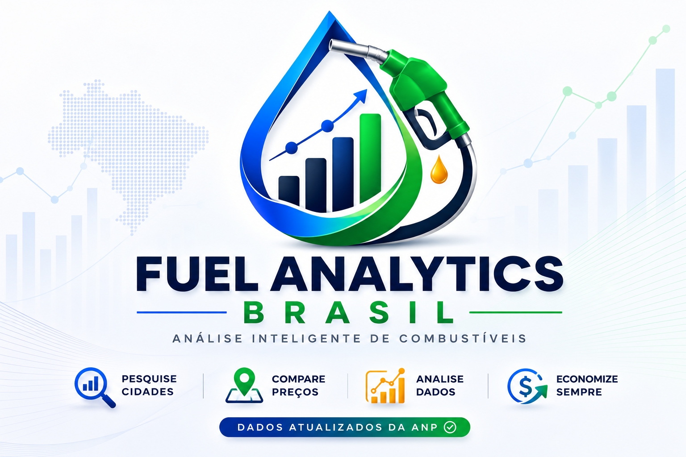

<p align="center">
    
</p>

<h1 align="center">
Fuel Analytics Brasil
</h1>

<p align="center">
Sistema Inteligente para análise e comparação de preços de combustíveis utilizando dados públicos da ANP.
</p>

---

# Demonstração

### Sistema Online

https://fuel-analytics-brasil-tan.vercel.app/

---

### API Online

https://fuel-analytics-apiuvicorn-main-app-host.onrender.com

---

## Objetivo

O Fuel Analytics Brasil é uma aplicação Full Stack desenvolvida para consultar, analisar e comparar preços de combustíveis em diversas cidades brasileiras utilizando dados públicos da Agência Nacional do Petróleo (ANP).

O sistema foi desenvolvido para demonstrar conhecimentos em desenvolvimento Back-end, Front-end, consumo de APIs, tratamento de dados, análise de informações e visualização gráfica.

---

# Funcionalidades

## Pesquisa por cidade

O usuário informa uma cidade.

O sistema consulta a API.

São exibidos:

- Cidade pesquisada
- Melhor combustível
- Menor preço
- Quantidade de combustíveis encontrados
- Cards individuais
- Estatísticas
- Ranking
- Gráfico de barras

---

## Comparação entre cidades

O usuário informa duas cidades.

O sistema compara automaticamente todos os combustíveis encontrados.

É exibida uma tabela mostrando:

- Diesel
- Diesel S10
- Etanol
- Gasolina
- Gasolina Aditivada
- GNV

Para cada combustível é mostrado:

- preço da cidade 1
- preço da cidade 2
- qual cidade possui o melhor preço

Também é gerado automaticamente um gráfico comparativo.

---

## Dashboard Inteligente

Após cada consulta o sistema gera indicadores rápidos contendo:

- Cidade
- Melhor opção
- Menor preço encontrado
- Quantidade de combustíveis

Esses indicadores permitem uma visualização rápida das principais informações.

---

## Estatísticas

A API calcula automaticamente:

- combustível mais barato
- combustível mais caro
- melhor combustível
- ranking de preços
- comparação Etanol x Gasolina

---

## Visualização Gráfica

O sistema utiliza gráficos desenvolvidos com Chart.js.

São apresentados:

- gráfico individual por cidade
- gráfico comparativo entre cidades

---

# Tecnologias utilizadas

## Back-end

Python

Linguagem principal responsável por toda a lógica da aplicação.

---

FastAPI

Framework moderno utilizado para criação da API REST.

Foi escolhido por possuir:

- alta performance
- documentação automática
- facilidade de criação de APIs
- excelente integração com Python

---

Pandas

Biblioteca utilizada para manipulação dos dados da ANP.

Responsável por:

- leitura do CSV
- filtragem
- agrupamentos
- cálculos estatísticos

---

Uvicorn

Servidor ASGI utilizado para executar a aplicação FastAPI.

---

Python Dotenv

Preparado para utilização futura de variáveis de ambiente.

---

# Front-end

HTML5

Estrutura completa da aplicação.

---

CSS3

Toda identidade visual foi construída manualmente.

Incluindo:

- responsividade
- cards
- dashboard
- tabelas
- gráficos
- animações

---

JavaScript

Responsável por:

- consumo da API
- requisições Fetch
- atualização dinâmica da tela
- geração dos gráficos
- comparação entre cidades

---

Chart.js

Biblioteca responsável pela criação dos gráficos.

---

# Arquitetura do Projeto

```
analise-combustivel-brasil/

│

├── data/
│   └── anp.csv

│

├── frontend/
│
├── css/
│   └── style.css
│
├── imagens/
│   ├── logo.png
│   ├── identidade-visual.png
│   ├── tela-home.png
│   ├── tela-cidade.png
│   └── tela-comparacao.png
│
├── js/
│   └── script.js
│
└── index.html

│

├── src/
│
├── api/
│   └── main.py
│
├── analysis.py
├── calculator.py
├── downloader.py
└── processor.py

│

├── requirements.txt

├── README.md

└── .gitignore
```

---

# Fluxo da aplicação

```
Usuário

↓

Frontend (HTML + CSS + JavaScript)

↓

Fetch API

↓

FastAPI

↓

Pandas

↓

CSV da ANP

↓

Processamento

↓

Resposta JSON

↓

Dashboard + Cards + Gráficos
```

---

# Endpoints da API

## Página inicial

GET /

Resposta

```json
{
  "mensagem":"API Fuel Analytics Brasil funcionando!"
}
```

---

## Consultar cidade

GET

```
/combustivel?cidade=campinas
```

Retorna

- preços
- ranking
- estatísticas
- melhor combustível

---

## Comparar cidades

GET

```
/comparar?cidade1=campinas&cidade2=sumare
```

Retorna

- comparação completa
- melhor cidade para cada combustível

---

# Dados utilizados

Os dados utilizados são públicos e disponibilizados pela Agência Nacional do Petróleo (ANP).

O arquivo CSV contém informações de preços médios praticados em diversas cidades brasileiras.

---

# Como executar localmente

## Clone o projeto

```bash
git clone https://github.com/Ytilonascimento/fuel-analytics-brasil.git
```

---

Entre na pasta

```bash
cd fuel-analytics-brasil
```

---

Instale as dependências

```bash
pip install -r requirements.txt
```

---

Execute a API

```bash
uvicorn src.api.main:app --reload
```

---

Abra o Front-end

Abra o arquivo

```
frontend/index.html
```

utilizando o Live Server do VS Code.

---

# Deploy

## Front-end

Vercel

https://fuel-analytics-brasil-tan.vercel.app/

---

## Back-end

Render

https://fuel-analytics-apiuvicorn-main-app-host.onrender.com

---

# Diferenciais do projeto

✔ API REST desenvolvida com FastAPI

✔ Dados reais da ANP

✔ Dashboard Inteligente

✔ Comparação entre cidades

✔ Ranking automático

✔ Estatísticas

✔ Gráficos interativos

✔ Interface Responsiva

✔ Deploy completo em produção

✔ Arquitetura organizada

✔ Código modular

✔ Projeto Full Stack

---

# Aprendizados

Durante o desenvolvimento deste projeto foram aplicados conhecimentos em:

- Python
- FastAPI
- APIs REST
- Pandas
- Manipulação de dados
- JavaScript
- HTML5
- CSS3
- Chart.js
- Deploy com Render
- Deploy com Vercel
- Git
- GitHub
- Organização de projetos
- Estrutura Full Stack

---

# Desenvolvedor

## Ytilo Nascimento

Análise e Desenvolvimento de Sistemas

Python • FastAPI • JavaScript • HTML • CSS • APIs REST • Pandas • SQL • Git • GitHub

GitHub

https://github.com/Ytilonascimento

LinkedIn

https://www.linkedin.com/in/antonio-ytilo-dev/

---

## Licença

Projeto desenvolvido para fins educacionais e demonstração de portfólio.